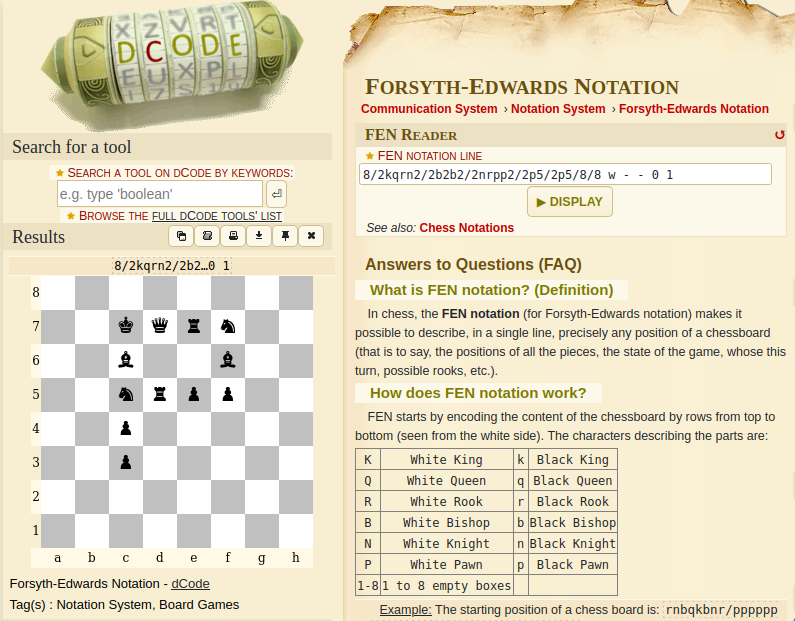
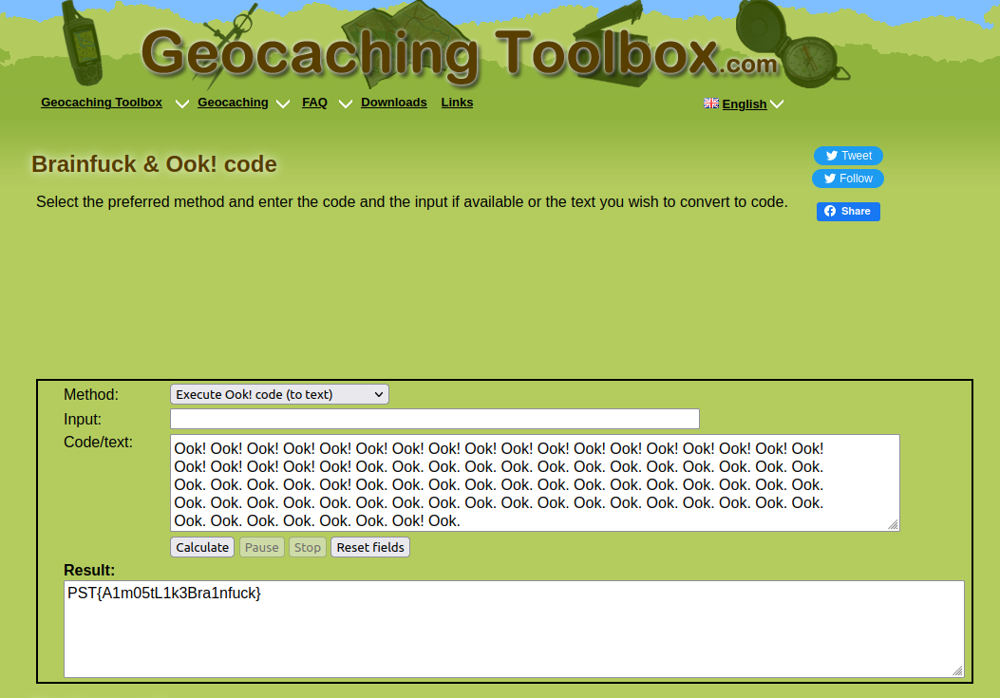

PST påskenøtter 2023
---

# Dag 1: Kongelig brøler

## Oppgavetekst
Pen GWYN gjorde en skikkelig brøler og ble tatt i forbifarten ved sikkerhetskontrollen på flyplassen. Under armen hadde han et sammenleggbart sjakkbrett med et dokument inni. Dokumentet ser ut til å være kryptert.

Undersøk filen og rapporter funn.

Mellomleder

📎 FEN.txt

## Data
FEN.txt:

```
FEN "8/2kqrn2/2b2b2/2nrpp2/2p5/2p5/8/8 w - - 0 1",
FEN "8/2kqrn2/2b5/2bnrp2/5p2/2pppp2/8/8 w - - 0 1",
FEN "8/1kqrnb2/3b4/3n4/3r4/3p4/8/8 w - - 0 1",
FEN "8/3kq3/3r4/2nb4/3b4/3nr3/8/8 w - - 0 1",
FEN "8/2k2q2/2rn1b2/2bnrp2/2p1pp2/2p2p2/8/8 w - - 0 1",
FEN "8/3kq3/2r2n2/2b2b2/2n2r2/3pp3/8/8 w - - 0 1",
FEN "8/2kqrn2/2b5/2bn4/2r5/2pppp2/8/8 w - - 0 1",
FEN "8/2k2q2/2rn1b2/2bnrp2/2p1pp2/2p2p2/8/8 w - - 0 1",
FEN "8/8/8/8/8/2kqrn2/8/8 w - - 0 1",
FEN "8/2k2q2/2r2n2/2b2b2/2n2r2/2pppp2/8/8 w - - 0 1",
FEN "8/1k3q2/2r1n3/2b1b3/3n4/3r4/8/8 w - - 0 1",
FEN "8/2kqrn2/2b2b2/2nrpp2/2p2p2/2p2p2/8/8 w - - 0 1",
FEN "8/2k2q2/2rn1b2/2bnrp2/2p1pp2/2p2p2/8/8 w - - 0 1",
FEN "8/2k5/2q5/2r5/2n5/2bbnr2/8/8 w - - 0 1",
FEN "8/3k4/3q4/3r4/3n4/3b4/8/8 w - - 0 1",
FEN "8/2kqrn2/2b5/2b1nr2/2p2p2/2pppp2/8/8 w - - 0 1",
FEN "8/2kqrn2/2b5/2bn4/2r5/2pppp2/8/8 w - - 0 1",
FEN "8/8/8/8/8/2kqrn2/8/8 w - - 0 1",
FEN "8/2kqrn2/2b5/2bnrp2/5p2/2pppp2/8/8 w - - 0 1",
FEN "8/1kqrnb2/3b4/3n4/3r4/3p4/8/8 w - - 0 1",
FEN "8/3k4/3q4/3r4/3n4/3b4/8/8 w - - 0 1",
FEN "8/2k5/2q5/2r5/2n5/2bbnr2/8/8 w - - 0 1",
FEN "8/2k5/2q5/2r5/2n5/2bbnr2/8/8 w - - 0 1",
FEN "8/3k4/3q4/3r4/3n4/3b4/8/8 w - - 0 1",
FEN "8/2k2q2/2rn1b2/2bnrp2/2p1pp2/2p2p2/8/8 w - - 0 1",
FEN "8/2kqrn2/2b5/2b1nr2/2p2p2/2pppp2/8/8 w - - 0 1",
FEN "8/2kqrn2/2b5/2bn4/2r5/2pppp2/8/8 w - - 0 1",
FEN "8/2kqr3/2n2b2/2bnr3/2p1p3/2p2p2/8/8 w - - 0 1",
FEN "8/2kq4/3r4/3nb3/3b4/2nr4/8/8 w - - 0 1"
FEN "pBrpnRrB/nPpbrBPP/rRbnpNBR/pBNBPrPP/pNrnNpPR/rPRBbNrB/bBPpNPpn/rPRbpRrN w - - 0 1"
FEN "nRrBBRPN/bBPNnrPP/rRPnRpNr/rNPbnprB/pPNbPbRP/rBRpNrBP/rNBRrPRp/nPBrbnrN w - - 0 1"
FEN "pPNBrbPp/bNBnPnrP/rNRbbprB/bPBrBPBr/pBNRrNnp/pPBnpPpP/rNBRnrBn/bNPBRRnN w - - 0 1"
```

## Løsning

Hver rad i filen inneholder en streng med [Forsyth–Edwards Notation (FEN)](https://en.wikipedia.org/wiki/Forsyth%E2%80%93Edwards_Notation). Dette brukes for å beskrive en bestemt sjakkstilling. Løsningen finnes ved å [visualisere](https://www.dcode.fr/fen-chess-notation) alle sjakkstillingene, f.eks. gir første rad bokstaven "P", andre rad gir "S" osv. Den endelige løsningen er `PST{NOEN_UVANLIGE_STILLINGER}`.




# Dag 2: Ook?

## Oppgavetekst
En orangutan mistenkt for samarbeid med sydpolare aktører har blitt arrestert. Han forsøkte å spise noen dokumenter før vi fikk tatt beslag i dem, men vi klarte å redde dette. Dessverre skjønner vi ikke et pip.

Se om du finner ut av noe. Ook?

Mellomleder

📎 Ook.txt

## Data

Ook.txt:

```
Ook. Ook. Ook. Ook. Ook. Ook. Ook. Ook. Ook. Ook. Ook. Ook. Ook. Ook. Ook. Ook. Ook. Ook. 
Ook. Ook. Ook! Ook? Ook. Ook? Ook. Ook. Ook. Ook? Ook. Ook. Ook. Ook. Ook. Ook. Ook. Ook? 
Ook. Ook. Ook. Ook. Ook. Ook. Ook. Ook. Ook. Ook. Ook. Ook. Ook. Ook. Ook. Ook? Ook. Ook. 
Ook. Ook. Ook. Ook. Ook. Ook. Ook. Ook. Ook. Ook. Ook. Ook. Ook. Ook. Ook. Ook. Ook. Ook. 
Ook? Ook. Ook? Ook. Ook? Ook. Ook? Ook. Ook! Ook! Ook? Ook! Ook. Ook? Ook. Ook? Ook. 
Ook? Ook. Ook. Ook. Ook. Ook. Ook. Ook. Ook. Ook. Ook. Ook. Ook. Ook. Ook. Ook. Ook. Ook. 
Ook. Ook. Ook. Ook! Ook. Ook. Ook. Ook. Ook. Ook. Ook. Ook! Ook. Ook. Ook. Ook! Ook. Ook. 
Ook? Ook. Ook. Ook. Ook. Ook. Ook. Ook. Ook. Ook. Ook. Ook. Ook. Ook. Ook. Ook. Ook. Ook. 
Ook. Ook. Ook. Ook. Ook. Ook. Ook. Ook. Ook. Ook. Ook. Ook. Ook. Ook. Ook. Ook. Ook. Ook. 
Ook. Ook. Ook. Ook. Ook. Ook. Ook. Ook. Ook. Ook. Ook. Ook! Ook. Ook? Ook. Ook! Ook! Ook! 
Ook! Ook! Ook! Ook! Ook! Ook! Ook! Ook! Ook! Ook! Ook! Ook! Ook! Ook! Ook! Ook! Ook! 
Ook! Ook! Ook! Ook! Ook! Ook! Ook! Ook! Ook! Ook! Ook! Ook! Ook! Ook! Ook! Ook! Ook! Ook! 
Ook! Ook. Ook! Ook! Ook! Ook! Ook! Ook! Ook! Ook! Ook! Ook! Ook! Ook! Ook! Ook! Ook! Ook! 
Ook! Ook! Ook! Ook! Ook! Ook! Ook! Ook! Ook! Ook! Ook! Ook! Ook! Ook! Ook! Ook! Ook! Ook. 
Ook. Ook? Ook! Ook! Ook! Ook! Ook! Ook! Ook! Ook! Ook! Ook! Ook! Ook! Ook! Ook! Ook! Ook! 
Ook! Ook! Ook! Ook! Ook! Ook! Ook! Ook! Ook! Ook! Ook! Ook! Ook! Ook. Ook? Ook. Ook! Ook! 
Ook! Ook. Ook. Ook. Ook. Ook. Ook. Ook. Ook. Ook. Ook. Ook. Ook! Ook. Ook. Ook? Ook. Ook. 
Ook. Ook. Ook. Ook. Ook. Ook. Ook. Ook. Ook. Ook. Ook. Ook. Ook! Ook. Ook? Ook. Ook. Ook. 
Ook. Ook. Ook. Ook. Ook. Ook. Ook. Ook. Ook. Ook. Ook. Ook. Ook. Ook. Ook. Ook. Ook. Ook. 
Ook. Ook. Ook. Ook. Ook. Ook. Ook. Ook. Ook. Ook. Ook. Ook. Ook. Ook. Ook. Ook. Ook. Ook. 
Ook. Ook. Ook. Ook. Ook. Ook. Ook. Ook. Ook! Ook. Ook? Ook. Ook. Ook. Ook. Ook. Ook. Ook. 
Ook. Ook. Ook. Ook. Ook. Ook. Ook. Ook. Ook. Ook. Ook. Ook. Ook. Ook. Ook. Ook. Ook. Ook. 
Ook. Ook. Ook. Ook. Ook. Ook. Ook. Ook. Ook. Ook. Ook. Ook. Ook. Ook. Ook! Ook. Ook. Ook? 
Ook. Ook? Ook! Ook! Ook! Ook! Ook! Ook! Ook! Ook! Ook! Ook! Ook! Ook! Ook! Ook! Ook! Ook! 
Ook! Ook! Ook! Ook. Ook? Ook. Ook? Ook. Ook. Ook. Ook. Ook. Ook! Ook. Ook. Ook? Ook! Ook! 
Ook! Ook! Ook! Ook! Ook! Ook! Ook! Ook! Ook! Ook! Ook! Ook! Ook! Ook! Ook! Ook! Ook! Ook! 
Ook! Ook. Ook. Ook? Ook. Ook. Ook. Ook. Ook. Ook. Ook. Ook. Ook. Ook. Ook. Ook. Ook. Ook. 
Ook! Ook. Ook! Ook! Ook! Ook! Ook! Ook! Ook! Ook! Ook! Ook! Ook! Ook! Ook! Ook! Ook! Ook! 
Ook! Ook! Ook! Ook! Ook! Ook! Ook! Ook! Ook! Ook! Ook! Ook! Ook! Ook! Ook! Ook! Ook! Ook! 
Ook! Ook. Ook? Ook. Ook? Ook. Ook! Ook! Ook! Ook! Ook! Ook. Ook. Ook? Ook. Ook? Ook. Ook. 
Ook. Ook. Ook. Ook. Ook. Ook. Ook. Ook. Ook. Ook. Ook. Ook. Ook. Ook. Ook. Ook. Ook. Ook. 
Ook. Ook. Ook. Ook. Ook. Ook. Ook! Ook. Ook! Ook! Ook! Ook! Ook! Ook! Ook! Ook! Ook! Ook! 
Ook! Ook! Ook! Ook! Ook! Ook! Ook! Ook. Ook. Ook. Ook. Ook. Ook. Ook. Ook. Ook. Ook. Ook. 
Ook. Ook. Ook. Ook. Ook. Ook. Ook. Ook. Ook. Ook. Ook. Ook. Ook. Ook. Ook. Ook. Ook. Ook. 
Ook. Ook. Ook! Ook. Ook! Ook! Ook! Ook! Ook! Ook! Ook! Ook! Ook! Ook! Ook! Ook! Ook! Ook! 
Ook! Ook! Ook! Ook! Ook! Ook! Ook! Ook! Ook! Ook! Ook! Ook! Ook! Ook! Ook! Ook! Ook! Ook! 
Ook! Ook! Ook! Ook! Ook! Ook. Ook. Ook. Ook. Ook. Ook. Ook. Ook. Ook. Ook. Ook. Ook. Ook. 
Ook. Ook. Ook. Ook. Ook! Ook. Ook. Ook. Ook. Ook. Ook. Ook. Ook. Ook. Ook. Ook. Ook. Ook. 
Ook. Ook. Ook. Ook. Ook. Ook. Ook. Ook. Ook. Ook. Ook. Ook. Ook. Ook. Ook. Ook. Ook. Ook. 
Ook. Ook. Ook. Ook. Ook. Ook. Ook! Ook.
```

## Løsning
Prøvde først å finne noe morsekode uten hell. Googlet til slutt "Ook code", og fant da ut at Ook! er et (tulle) programmeringsspråk. Brukte en [online dekoder](https://www.geocachingtoolbox.com/index.php?lang=en&page=brainfuckOok) og fant flagget `PST{A1m05tL1k3Bra1nfuck}`.



# Dag 3, Vårrengjøring

## Oppgavetekst

Mellomleder ba meg se på dette bildet i går, men nå har jeg stirra på det til jeg blir skjeløyd og finner ingenting! Kan du ta over saken?

Tastefinger

PS: Om du trenger en rubber duck for å debugge noe kan du låne stegosauren som står på plassen min.

📎 bilde.png

## Data

bilde.png:


## Løsning

Se på bildet og [skjel](https://en.wikipedia.org/wiki/Autostereogram) med øynene til 3D-teksten vises: `PST{Med_øyne_i_kryss}`.
