PST julekalender 2023
---

## 1. des: Mobil-detektiven

Her får du den første oppgaven!

Under etterforskningen av hendelsen på jule-verkstedet har vi oppdaget noe rart. Et av meldingssystemene som sender varslinger til beredskapsvaktene for verkstedet har sendt en SMS til et ukjent nummer. Meldingen er dessverre helt uleselig for oss, så vi trenger dine mobildetektiv-egenskaper. Når du finner ut av det, send meg svar på formatet PST{ditt svar her}.

7-4 9-3 7-4 8-1 3-2 6-1 0-1
4-3 6-2 3-3 4-3 7-4 3-2 7-3
8-1 0-1 4-1 7-3 8-2 6-2 5-2
3-2 7-3 0-1 4-3 6-2 2-3 6-3
6-1 4-3 6-2 4-1

-Tastefinger

---

Fra et tastatur på telefonen 7-4=S, 9-3=Y osv.:

S Y S T E M +
I N F I S E R
T + G R U N K
E R + I N C O
M I N G

--> PST{SYSTEM INFISERT GRUNKER INCOMING}

## 2. des: Scrambled

Over natten har det vært store utfordringer knyttet til en av maskinene i verkstedet.
En serie feilproduserte leker har kommet på rullende bånd.
Vi prøver å finne ut hva som har skjedd. Graver du ned i det her?
-Mellomleder

📎Bilde

 
 

 ---

Alle feltene har sin faste plass, så kan løse kuben uten å ha en fysisk kube. F.eks. vil 'S' alltid være i midten av grønn rute, og grønn 'U' og hvit 'E' vil alltid være sammen. Med dette kan kuben løses "manuelt" uten å ha en fysisk kube (tegnet inn på et tomt rutebrett med [Krita](https://en.wikipedia.org/wiki/Krita)):

  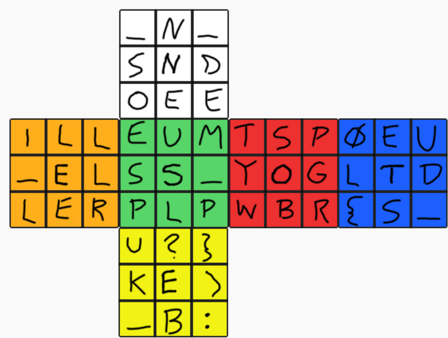

Fra rekkefølgen på de midtre feltene som er i oppgavebildet: 
Rød: (støy) PST
Blå: {LØSTE_DU
Hvit: _DENNE_SO
Grønn: M_PUSLESP
Oransje: ILL_ELLER
Gul: _KUBE?:)}

--> PST{LØSTE_DU_DENNE_SOM_PUSLESPILL_ELLER_KUBE?:)}}

## 5. des: Muldvarpjakt

Gjennom temmelig hemmelige innhentingsmetoder har vi fanget opp en melding om et nært forestående møte på Fastlands-Norge mellom en mistenkt kildefører som jobber for sydpolare tjenester og et ukjent objekt vi mistenker kan være en muldvarp.

For at våre spaningsalver skal settes i stand til å observere møtet og identifisere det ukjente objektet må vi vite hvor vi skal sende våre alver.

Vi prøvde å spørre OSINT-alvene våre, men de var travelt opptatt med å saumfare sosiale medier etter snille og slemme barn. De mumlet noe om at vi kunne fikse det selv med “turbo overgang”.

Kan du ut fra meldingen finne ut hvor de skal møtes?

*Ta bussen og gå av på holdeplassen rett ved begravelsesbyrået som ligger inntil en sjømatbutikk. Jeg vil stå klar ved fontenen noen titalls meter fra bussholdeplassen. Når du har kommet frem til fontenen, vil vi sammen gå til det nærliggende biblioteket som ligger under 50 meter fra fontenen og gjennomfører overføringen.*

Svar meg med navnet på møtestedet og på formen PST{BERGEN LUFTHAVN}

-Tastefinger

---

Hintet i oppgaveteksten om "turbo overgang" referer til [overpass turbo](https://overpass-turbo.eu/), som er et API/brukergrensesnitt for å filtrere kartdata fra OpenStreetMap. Ved hjelp av dette verktøyet kan man lage en spørring basert på beskrivelsen som finner møtestedet:

```
[out:json][timeout:200];

// Ta bussen og gå av på holdeplassen rett ved begravelsesbyrået som ligger inntil en sjømatbutikk. 
// Jeg vil stå klar ved fontenen noen titalls meter fra bussholdeplassen.
// Når du har kommet frem til fontenen, vil vi sammen gå til det nærliggende biblioteket
// som ligger under 50 meter fra fontenen og gjennomfører overføringen.

node["highway"="bus_stop"]({{bbox}})->.bus_stop;

node["shop"="funeral_directors"]({{bbox}})->.funeral_directors;

node["shop"="seafood"]({{bbox}})->.seafood;

node["amenity"="fountain"]({{bbox}})->.fountain;

node["amenity"="library"]({{bbox}})->.library;


node.bus_stop(around.funeral_directors:50)(around.seafood:50)->.bus_stop_near_funeral_directors_near_seafood;

node.library(around.fountain:50)(around.bus_stop_near_funeral_directors_near_seafood:100);

out geom;
```

Velger et kartutsnitt av hele Norge (dette er da bbox) og kjører spørringen, og man finner stedet som er beskrevet:

 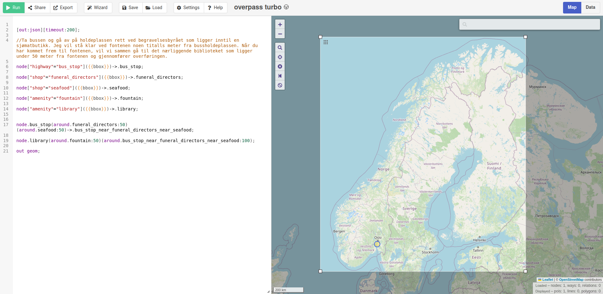

Ved å zoome inn finner man biblioteket det spørres etter.
 Flagget er altså PST{FROGN BIBLIOTEK}.

 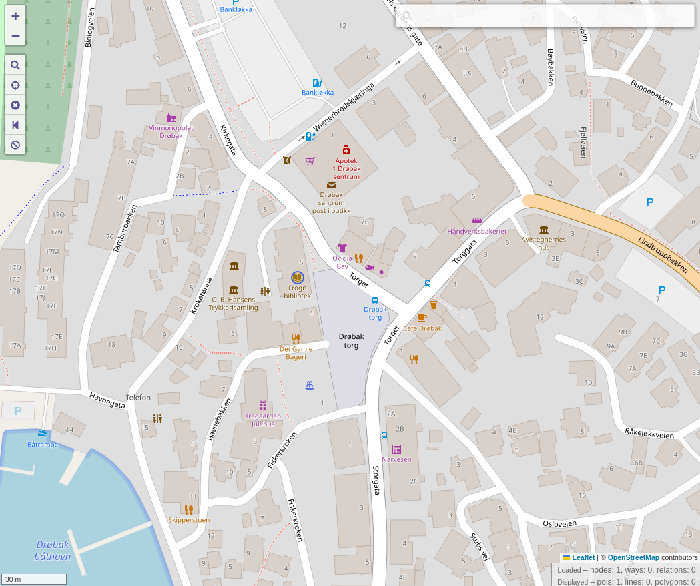


## 6. des: KAKER-kontroll

I en standard KAKER-kontroll (Kontroll Av Kommuniké med Eksport-Restriksjoner) har det blitt tatt en kopi av dette dokumentet. Vi syns det er snodig at akkurat denne personen har hatt med seg dokumentet siden personen har hatt anti-jul-holdninger tidligere, og vi vil derfor at du tar en nærmere kikk for å se etter uhumskheter.

-Tastefinger

```
PE‍PPERKAKER {
    POR‍SJONER {
        20 kaker
    }
    ‍TYPE ‍{
        julekake
    }
    INGREDIENSER {
        KAKEDEIG {
            2 ts ‍Pepper
            2 ts Malt ing‍efær
            0,5 ts Malt nellik
            3 dl Mørk siru‍p
            300 g Smør
            2 ts Malt kanel
            4 ts Natron
            2 stk. Egg
            300 g Sukker
            ca. 900 g Hvetemel
        }
        MELISGLASUR {
            ca. 250 g Melis
            1 stk. Eggehvite
            0,5 ts Sitronsaft
        }
    }
    OPPSKRIFT {
        STEG1 { Bland smør, siru‍p og sukker i en kjele. Varm opp til sukkeret er sm‍eltet. Tilsett nellik, ingefæ‍r, pepper og kanel, og rør godt sammen. }
        STEG2 { Ta ‍kjelen av platen og avkjøl bl‍andingen noe. Rør inn egg. }
        STEG3 { Ha i natron, og si‍kt inn mel. Rør alt sammen til ‍en jevn deig. Deigen skal væ‍re ganske myk og klissete, den vil bli mye hardere når den blir kald! }
        STEG4 { Hell deigen over i en bolle og dryss litt hvetemel på toppen. Dekk til med litt plastfolie og sett deigen kaldt noen timer, gjerne over natten. }
        STEG5 { Skjær løs et stykke av deigen. Plasser resten av deigen tilbake i kjøleskapet. ‍Elt deigen forsiktig. Tilsett litt me‍r mel om den virker for myk. }
        STEG6 { ‍Mel en flate, ‍og kjevle deigen ut til ca 3 mm tykkelse. Det er enklest når deigen er myk som plas‍tilina. Stikk ut pepperkakefigurer og flytt dem over på et ‍bakepapirkledd stekebrett. Samle restene av deigen og legg den kaldt. Skjær ut et n‍ytt stykke av ‍deigen og gjenta prosessen. Deigen blir vanskelig å jobbe med når den blir for varm, så da kan d‍en få hvile i kjøleskapet igjen. }
        STEG7 { Stek kakene midt i stekeovnen på 175 °C i ca. 10 minutter. Avkjø‍l kakene helt på rist. }
        STEG8 { Bland sammen mel‍is, eggehvite og sitronsaft til en tykk ‍glasur, og dekorer kaken‍e. }
    ‍}
}
```

---

Åpner oppskriften i Notepad++, og ser at den inneholder en del [skjulte tegn](https://en.wikipedia.org/wiki/Zero-width_joiner):

 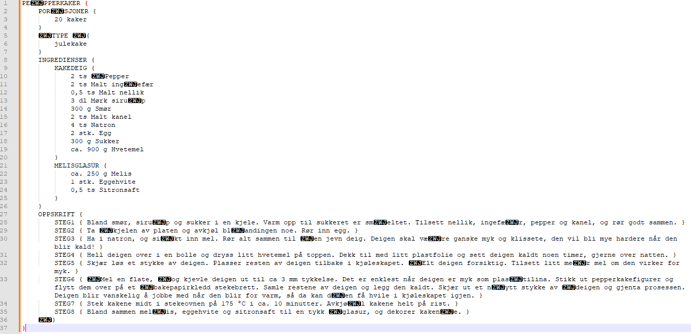

 Ved å lese av hvert tegn etter de skjulte tegnene så finner man flagget:

PST{PepperkakerErMotbydelige}

## 7. des: Alle gode ting er tre

Alveresepsjonen fant en mystisk lapp i postboksen til Nissens verksted i dag tidlig. Vanligvis er dette noe Ronny, Shahana og Ada fra alvdeling for kryptografi ville tatt seg av. Dessverre er alle tre bortreist på en viktig konferanse i San Francisco for å høre om den siste utviklingen innen eksponenter og modulær aritmetikk. Kan du steppe inn for dem og finne ut av hva denne beskjeden egentlig er for noe?

-Mellomleder

📎msg.txt

```
N = 0x5993c05eac819aa17ae7e4e4b9f75b2d6fdbaec913e0b2d6f4ba585a991b62279ed9ac53aeadee3327321e02c0c06ecda184952df5d1cc8b3024643c0afdd9bbd52bf2d830f54d6e59e76844394eb0ffc498995dd270b9b95bf1614984472a3ef12d8c1bad64529be7b638c5d0fccf61c5ac2ab4564e5215748eb2533d4d949afd9486426dbf0c06a07c2c0f6d482e4f8cf3052e6ab9df20878b747936d590c3b8bb0219a378cbec03baee4ea8d0641c57bcc18706bbe92c3f2d7569c424062d9b79464958419b4000e3e31c077bba27ef2fc6ed15b7ebdcdb41d1cbf7708737e200904015d341ef94c537a916f1fec61e0b1bf64762e5a97bafdde290b939c3
e = 3
C = 0x755040806d1d699c76cf2b3fffc28ad8831a8667e1b064297a43733b89f6272483a5a728b725d02b069f8fc65eb51d89ce9133df8f5f2d5e13f63c5423021eb2b56eeb91b11d78717528dfce169450a08d40f5ab451c8ac1f8c6875cffbd4d70259d436ed70baeae37b9bdafc5965
```

---

Fra oppgaveteksten og innholdet i filen så ser man at dette er et RSA chiffer. Ved hjelp av en [online dekoder](https://www.dcode.fr/rsa-cipher) kan innholdet [dekodes](https://en.wikipedia.org/wiki/Coppersmith%27s_attack):

 

 --> NSM{af0dbd13cee45990593c182b213f978d}

## 9. des: Kronolokalisering

Gjennom et beslag har vi fått tak i et papirark. På den ene siden står det “Oppmøtested for den topphemmelige sydpolinfiltrasjonen 2023, rekognosering 23. november”. På den andre siden av arket er det et bilde.
For å kunne hente inn overvåkingsbilder og identifisere hvem som har planlagt arrangementet trenger vi det nøyaktige tidspunktet bildet er tatt.

Send meg svar på denne eposten som KRIPOS{tidspunkt}, f.eks. KRIPOS{23:35}, rundet av til nærmeste fem minutter.
-Mellomleder

 

 ---

 Forsøkte først å finne metadata til bildet med verktøy som f.eks. [ExifTool](https://en.wikipedia.org/wiki/ExifTool), men fant ikke noe informasjon om når bildet var tatt. Gjorde så et bildesøk med bildet:

 

 Bygningen på bildet er [Europol](https://no.wikipedia.org/wiki/Europol) sitt hovedkvarter i Haag. Det er ikke Google Street view bilder fra begge sider av bygningen, men kommer nærme nok til å se den østlige siden av bygningen hvor bildet er tatt:  

 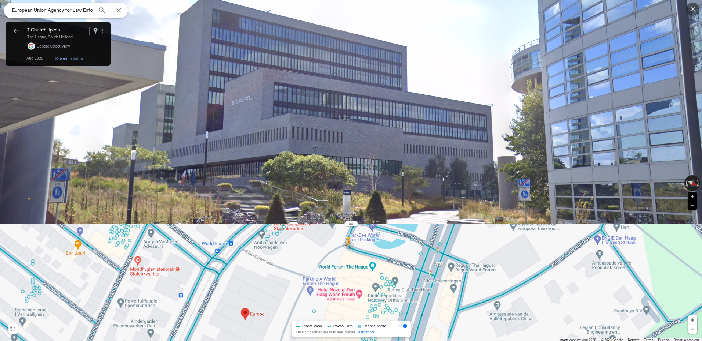

 Bygningen ligger nesten i nord-sør retning, og skyggen fra den høyeste delen dekker nesten den lavere delen. Sola må altså omtrent være i sør, hvilket vil si at det omtrent er midt på dagen at bildet er tatt.

 Bruker nettsiden http://shadowcalculator.eu til å zoome inn på Europol-bygningen, sette dato til 23. november 2023 og legge en skygge fra den høyeste bygningen. Varierer så tidspunktet til skyggen treffer den lavere bygningen på samme sted som i oppgavebildet. Som vist i bildene nedenfor så er skyggen lik ca kl 13:20, som er løsningen på oppgaven: KRIPOS{13:20} 

 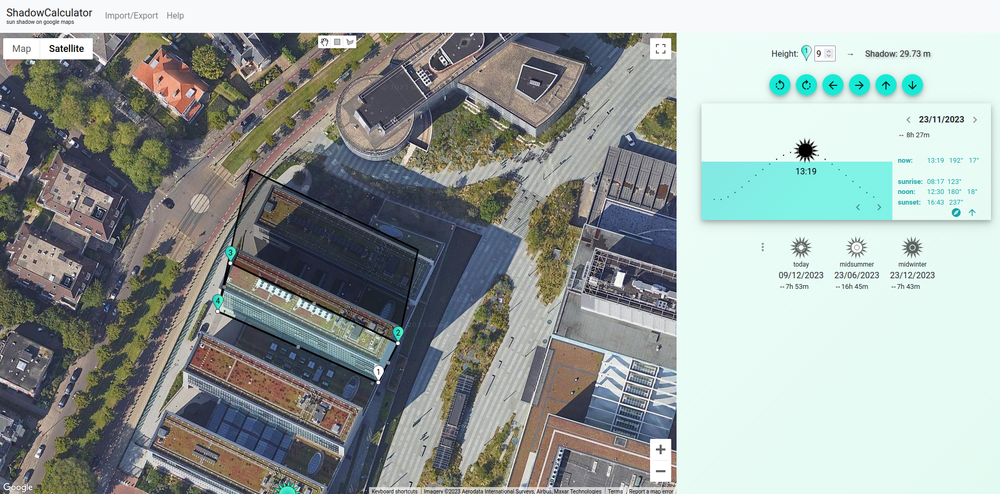
 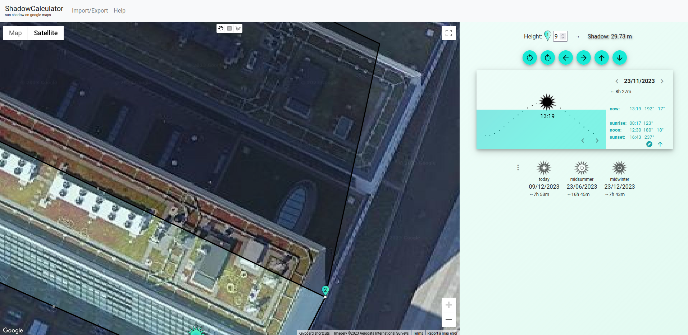

## 10. des: Alvesortering

De strenge alvene har skrevet ned et julekodeord, men i den ivrige sorteringen av pakker har det skjedd en horribel feil og alt er blitt rot! Ordet har blitt borte i det som ser ut som et virrvarr av tilfeldig tekst! Nå trenger de hjelp til å gjenfinne ordet. De har null peiling på hvor langt ordet er. Kan du å gjenfinne ordet?

-Mellomleder

📎random_text.bin

---

Filen inneholder en lang streng som også inneholder flere [null-karakterer](https://en.wikipedia.org/wiki/Null_character) 
```
$ wc --bytes random_text.bin 
1509605 random_text.bin

```
 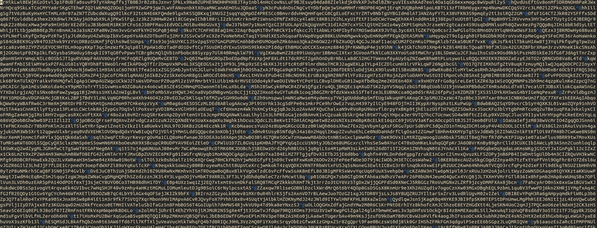

```
vim:
:%s/^@//gn
10024 matches on 1 line
```

Deler opp i flere rader splitted på null-karakterene, og sorterer så på lengden av de nye radene:

```
$ tr '\0' '\n' < random_text.bin > output.txt
$ awk '{print length, $0}' output.txt | sort -n | cut -d" " -f2- > sorted_output.txt
```


```
$ head -n30 sorted_output.txt
PfsWdw8E3oC
S7cZPBkxdSToqc
Txt7WQwxyMjxUM0nb
{9GxFLUeEJVdN74RtjDc
jnbJpeFbfNX1raROEVBSV3E
uTld0fAJXiNCfKXBpUdM7zAAea
lSYmu1WnzbZ8knnGHo1D4QJSPIHea
esKkf1r2vQ9rM8YmolUQaTwgNQXIirXb
nKBRXKcbhqnNgEgEZytzqEkMj28qTAahC6U
iUlRR7QtH1LsLhGLfWkGVYC2lhweFW1OrkAYmP
sKtcaELLBTgefdZg1kPlPHLWsYkGApey7cjnDzwM2
smvaez0QaGTgZECQbLINFR7AtdgPrSdqDCHObmdhcuB7
eneEcaltAaPUKhMNkCFZPRh2FE6Tolrj3rMbfIv4A4563xA
Sl8siG7smqmAA4h1rzOWml5ZHCpEKjpUFUMDrj4YqXk3L2t58b
tbcdcj8ryOYutkhsZ4r7WkgdsDrx32ooy9ky8Eup1o7Dmm7ZJGxmQ
rr8k9Z5WIPtyPvqAihjieNR6A2smIJwq16vqBG3qY8lIuhEXQdi4ZOkR
edOadsFymZmocRNgbfwllDVNTMNpOfkhfrfvWQ21gfOG61lZJV9Z1qUugay
ntnpIVeWHQjAuSf7s2B1rDHrZREOLD8ZbF3PnLQ8rhuubQRarTUD5DGmNTE8x2
gwGIkomr41mvKjuob7T6jY1VkwAn8Qq886ZU8OUVKkIfIfkZTP2bchWqgqaOEp9BX
0ECbJWFBsI5OE24oWusXipGOPWVQAo5bJlVNVHjy9tekdobaJJLsG2DWKaD44Dvt46E4
AaHesHr7D3tzrS7PeKwiEHiAHXyDIYolGCXqbRN35y97byPlY3gD8rBAsNrfp3N4xZU2RO3
lDgBfXm5cl9O2tMGr1Sobka7rGanxjfY9VXLX4rH5OYgnBAYRVR6EUOqQYD4sed6YvilGBgcJx
v32wFXWctuWv7HViCiakuAZOt6PBtRbLTf6iDCtGW4srXgZ6uAB8uBIyyvPI22hGUxMgGscEf2m7l
}e5g2xsgM0DxcUTX73DWZigGtuY4CmPy3xN4c52DcU2UDxdg2WegrFuYGK7W5LAygqenX1Y6djNbGOZu
15AGNesJkaJ2lCydmfRqw0BC1M0mJUxnOlksqXKb4wdU6a9VOe5XaPOD6xxHN7vZlWgByrrqVBc4SaQmlx9Yg26COOtnKJlMvOcl
1d9QlS01C9N3xXkwgUFuBAuo6RqLdFNSMaFNBGmEPNlDgCpfcOuQOYjxnc5l7yNmiNskKBE0TFZmrBjjsfJYhg8LrALac8FoTG7o
1NFFvT9D1TgtM9DW4fbj14gFqTA2XIZHCV7Dt5Pnmgbt6t0qGIsbjS7ClYe3NJQWCaO3SQBUn9n25a8dFJXtuEdv2W7P9EJZapsI
3a9TfAAN5o3eW90NCNuOMcrPYGBOwwLij8UcUYmvv9xiDTmCSZq2FDBHR3DRC3b6UL6zhWTLZX2tck8au5LYbXwvPbDzizMwQgb0
3cifCFgPit3igLZj71WhZhavZ7A803YP7XOOonRwmDoFdKbSvKzOOYbyoWvMwaQPpD2nLggv3bBoypA4gHTPTPyJpwXjOPmgcG3d
4M25lXUw7IGVUK39dkQnCbEIFdvsQEcLtwgkE06slIRMNRSPCjzkSDg7dAQsd3LfLL5kXX9gJKBAOa8hbV5T7iibJKubfndh9ZU6
(...)

```

Leser nedover de første bokstavene på hver rad:
--> PST{julenisseStreng0Alv}

## 12. des: Pakkestorm

Jeg har vært på et temmelig hemmelig oppdrag og fulgt med på en server som har hatt mistenkelig oppførsel tidligere. Nå tok vi den igjen når den begynte å sende masse pakker, men selv om jeg som alle andre alver liker pakker så ble det litt for mye av det gode. Kan du finne de onde for meg?

-Tastefinger

📎fangede_pakker.pcap

---

Henter ut IP-adresse og data fra hver pakke:

```
> & 'C:\Program Files\Wireshark\tshark.exe'  -r .\fangede_pakker.pcap -T fields -e ip.dst -e data.data > output.csv

> wc .\output.csv
  347713   695426 23815092 .\output.csv

> head -n15 .\output.csv
▒▒155.77.128.81 306231303130303030
242.150.91.88   306231303130303030
173.73.220.125  306231303130303030
134.214.218.157 306231303130303030
100.94.120.90   306231303130303030
216.81.234.88   306231303130303030
34.177.216.65   306231303130303030
107.4.248.181   306231303130303030
180.85.56.86    306231303130303030
231.170.2.214   306231303130303030
132.106.126.188 306231303130303030
152.150.142.56  306231303130303030
161.120.127.239 306231303130303030
191.240.147.193 306231303130303030
88.120.171.11   306231303130303030
```

Limer alt inn i Notepad++ og lager filen på nytt som output_with_ip.txt; dette fjerner diverse spesialtegn og sørger for at dataen (andre kolonne) blir formatert som tall.

Lager et Python-skript som henter ut alle tegn per IP-adresse:

```
def to_chr(hex_data):
    byte_data = bytes.fromhex(hex_data) # hex til bytes
    string_data = byte_data.decode('utf-8', errors='ignore')[2:] # Fjerner '0b'
    return chr(int(string_data, 2))

characters = []
with open('data/output_with_ip.txt') as f:
    for line in f:
        ip, hex_data = line.strip().split()
        character = to_chr(hex_data)
        characters.append((ip, character))

ip_characters = {}
for ip, char in characters:
    if ip in ip_characters:
        ip_characters[ip] += char
    else:
        ip_characters[ip] = char

combined_data = list(ip_characters.items())

with open('flags.txt', 'w') as file:
    for ip, chars in combined_data:
        file.write(f"{ip} {chars}\n")
```

```
> head -n10 .\flags.txt
155.77.128.81 PST{It_CAN_HAZ_bASIc_DInneR!}
242.150.91.88 PST{hE_CAn_hAZ_dIShonEST_VOicE?}
173.73.220.125 PST{You_CAn_HAZ_HummING_RaIN?}
134.214.218.157 PST{hE_CAN_HAz_fOrmal_YEAR!}
100.94.120.90 PST{It_caN_HaZ_FlIMZy_SafETy?}
216.81.234.88 PST{IT_CAN_HaZ_tRAUMaTiC_fActOrY?}
34.177.216.65 PST{iT_CAN_haZ_tePiD_MiNute?}
107.4.248.181 PST{YOU_cAn_HAZ_iMPREsSIOnable_DEZirE?}
180.85.56.86 PST{He_CaN_HAz_MELLOW_OxfORD!}
231.170.2.214 PST{it_Can_HAZ_deLICiOUz_advANCE?}
```

Totalt er det det 11000 slike flagg. Fikler rundt i Wireshark og finner ut at det kun er én IP-adresse som oppfyller filteret `ip.flags.mf==1 && ip.flags.rb==1`:

 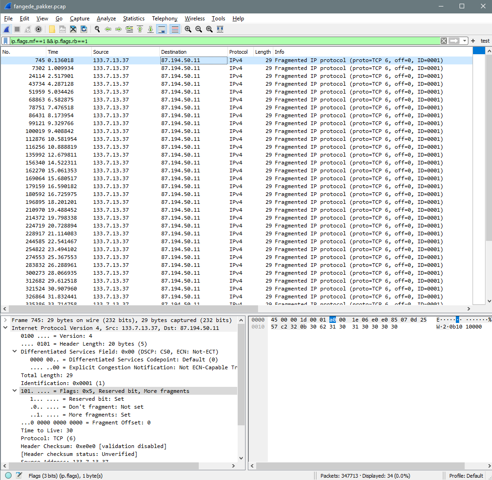

--> 87.194.50.11 PST{I_cAn_HaZ_rEciprOCaTeD_tRuzT?}


## 13. des: GeoGjettr

Ledelsen har fått dilla på GeoGjettr og jeg er med i en konkurranse, men klarer ikke finne ut av hvilken by bildet her er fra. Kan du hjelpe meg litt fort?

Svar meg med KRIPOS{navn på by}.

-Mellomleder

📎bilde.jpg

---


 

 Bildet inneholder en QR-kode, men denne firkanten nederst til venstre er ødelagt. Reparerer denne i Paint ved å kopiere en av de andre firkantene:


 

 QR-koden kan nå scannes, og man finner ut at restauranten heter The State Buildings som ligger i Perth --> KRIPOS{PERTH}

 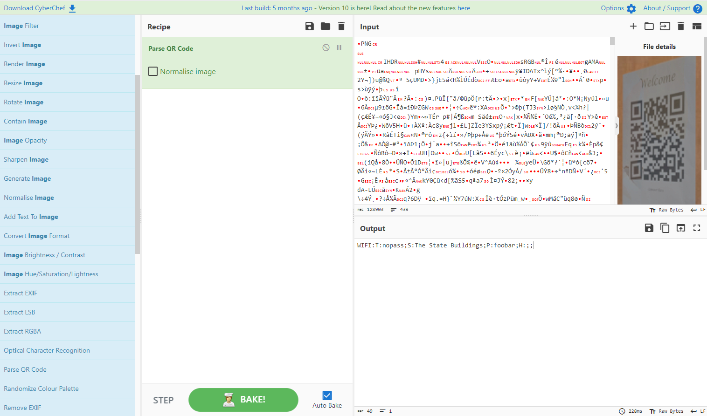


 ## Dag 14: Bokorm

 En snok vi mistenker å stå i ledetog med Pen GWYN har blitt arrestert etter å ha brutt seg inn i NordPolarBiblioteket og stjålet noen bøker. Vi mistenker at de har vært ute etter noe spesifikt, men vi blir ikke helt kloke på hva det er. Snoken ble tatt med en stabel bøker og et notat.

Bøkene har vi gitt tilbake til biblioteket, men her er en liste av dem som ble stjålet:

    Norrøn arverett og samfunnsstruktur
    Radium og radioaktive stoffer, samt nyere opdagelser angaaende straaler
    Undertrykking av objekter med høy luminans ved hjelp av en romlig lysmodulator under avbildning med CCD- og lysforsterkningskamera
    Om den yngre Jernalder i Norge : 1. afdeling
    Storlogens Konstitution og Tillægslove
    Sild- og saltfiskretter

Notatet inneholdt dette her:
(55, 1, 2, 1), (65, 17, 6, 3), (19, 3, 8, 1), (13, 5, 6, 2), (14, 11, 4, 8), (27, 32, 12, 2), (9, 7, 12, 3), (82, 5, 2, 8), (78, 3, 11, 1), (71, 5, 1, 8), (76, 1, 6, 2), (92, 1, 1, 1), (50, 2, 1, 5), (15, 1, 1, 1), (82, 16, 10, 4), (23, 6, 1, 1), (34, 16, 7, 1), (92, 11, 3, 2), (50, 5, 6, 1), (1, 3, 5, 12), (42, 2, 1, 1), (15, 3, 1, 3), (23, 8, 1, 2), (90, 2, 5, 1), (83, 1, 1, 2), (59, 29, 9, 4), (93, 4, 1, 16), (82, 8, 3, 5), (39, 1, 1, 8), (77, 7, 9, 1), (93, 8, 6, 8), (1, 1, 3, 6), (83, 10, 8, 1), (23, 1, 1, 1), (69, 2, 9, 2), (76, 12, 3, 4), (7, 1, 3, 1), (3, 9, 9, 2), (19, 1, 6, 10), (93, 14, 7, 5), (13, 31, 7, 10), (3, 1, 9, 2), (7, 2, 6, 1), (23, 19, 4, 3), (50, 6, 5, 11)

Send svar til meg om du finner ut av det.

-Tastefinger

---
Søker etter alle bøkene på [Nasjonalbiblioteket](nb.no]), og finner ut at den eneste boken som er åpen for lesning er "Om den yngre Jernalder i Norge : 1. afdeling" (NB: Måtte fjerne kolonet ved søking!).

 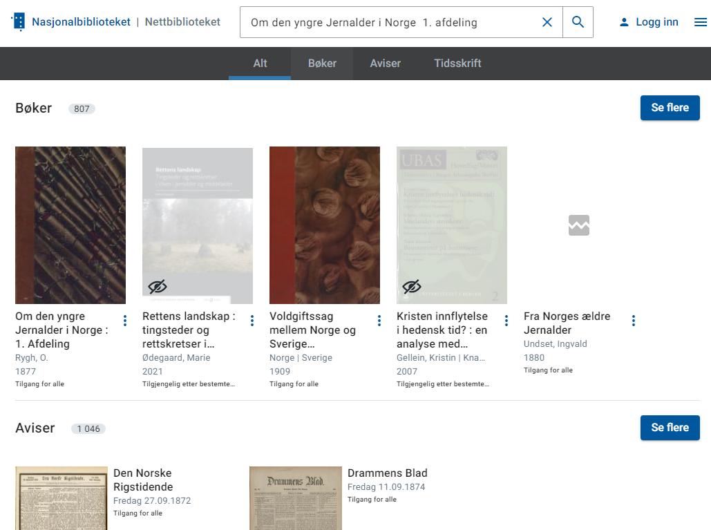

Finner så flagget ved å lese notatet som Sidetall, linjenummer, ord, bokstav. F.eks. blir (65, 17, 6, 3) til 's'. Fortsetter slik og får PSTKROLLPARANTESBOKSTAVJAKTKROLLPARANTESSLUTT.
--> PST{BOKSTAVJAKT}

 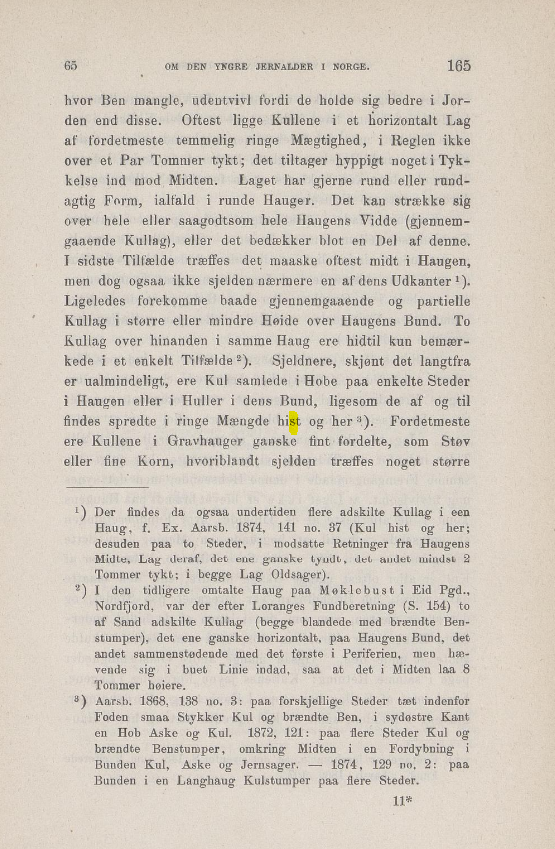